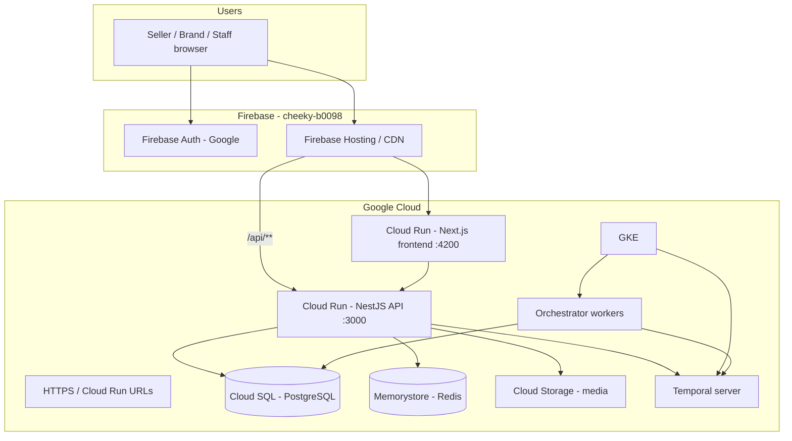
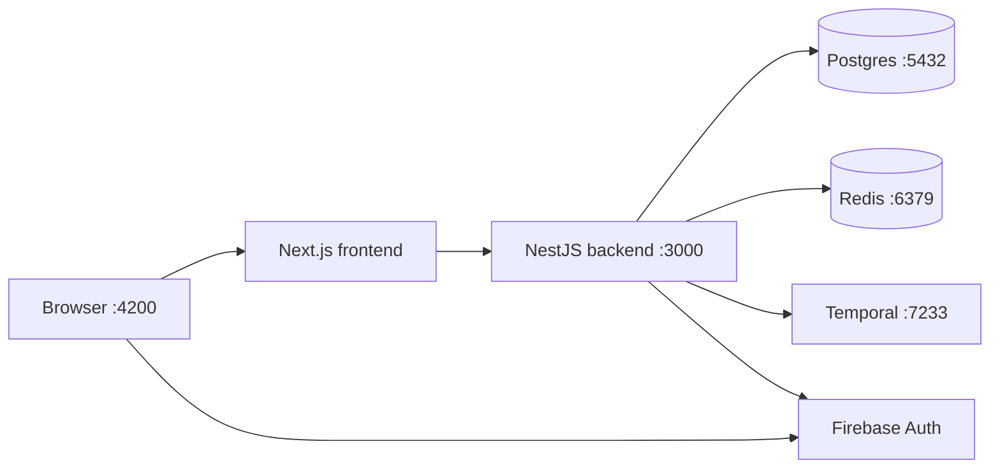

# Cheeky Social

Internal multi-social management portal for **Cheeky** sellers, brands, and staff.

Connect social accounts, schedule posts, and manage promotions from one workspace per seller/brand. Built on a fork of [Postiz](https://github.com/gitroomhq/postiz-app) (AGPL-3.0), rebranded and wired for **Firebase Auth (Google)** and **Google Cloud**.

| | |
|--|--|
| **Audience** | Cheeky internal only (sellers, brands, ops) |
| **Branch** | `feat/cheeky-social-portal` |
| **Firebase** | Project `cheeky-b0098` · app **CheekySocialMediaPortal** |
| **Package manager** | pnpm only |
| **Node** | `>=22.12.0 <23` (recommended; Node 26 may work with warnings) |

---

## What it does

- Google sign-in / sign-up via Firebase
- One **workspace (organization)** per seller or brand
- Link social channels and schedule posts (calendar)
- Media library uploads
- Cheeky staff can be granted cross-workspace access (`isSuperAdmin`)

---

## Architecture

### Target production (GCP + Firebase)



| Layer | Service | Role |
|-------|---------|------|
| Identity | Firebase Auth | Google sign-in / sign-up |
| Edge | Firebase Hosting | Static/CDN + rewrites to Cloud Run |
| App | Cloud Run (frontend + API) | Next.js UI + NestJS API |
| Data | Cloud SQL (Postgres 17) | App database (Prisma) |
| Cache | Memorystore (Redis) | Rate limits / cache |
| Media | GCS | Uploads / avatars (`STORAGE_PROVIDER=gcs`) |
| Jobs | Temporal + orchestrator on GKE | Scheduled posting, emails, token refresh |

Full deploy checklist: [`deploy/gcp/README.md`](deploy/gcp/README.md)  
Design spec: [`docs/superpowers/specs/2026-07-16-cheeky-social-gcp-design.md`](docs/superpowers/specs/2026-07-16-cheeky-social-gcp-design.md)

### Local development



Infra is started with Docker Compose (`docker-compose.dev.yaml`). App processes run on the host via pnpm.

---

## Monorepo layout

```
apps/
  backend/       NestJS API (Temporal client)
  frontend/      Next.js UI
  orchestrator/  Temporal workers (schedule / publish)
  commands/      CLI helpers
libraries/
  nestjs-libraries/   Shared server logic, Prisma, integrations, uploads
  react-shared-libraries/
  helpers/
deploy/gcp/      Cloud Run / GKE / Firebase Hosting skeletons
secrets/         Local-only (gitignored) — Firebase Admin JSON
```

---

## Prerequisites

Install on your machine:

1. **Node.js 22.x** (prefer 22.12+) — [nodejs.org](https://nodejs.org/)
2. **pnpm 10.6.1** — `npm install -g pnpm@10.6.1`
3. **Docker Desktop** — running, with WSL2/backend ready on Windows
4. Access to Firebase project **`cheeky-b0098`** (Google sign-in enabled)
5. Git clone of this repo

Optional later: `gcloud` / Firebase CLI for cloud deploy.

---

## Quick start (local — internal)

### 1. Clone and install

```bash
git clone https://github.com/Cheeky-Fit/Multi-posting-app.git
cd Multi-posting-app
git checkout feat/cheeky-social-portal
pnpm install
```

### 2. Environment + Firebase credentials

Ask a Cheeky maintainer for the local `.env` and Firebase Admin JSON (do not commit either).

1. Place `.env` in the repo root
2. Place the Admin JSON at `secrets/firebase-admin.json` (gitignored)
3. Confirm the path in `.env` matches where you saved the JSON

### 3. Start infrastructure

```bash
pnpm dev:docker
# equivalent: docker compose -f docker-compose.dev.yaml up -d
```

This starts Postgres, Redis, Temporal (+ UI on http://localhost:8080), pgAdmin, RedisInsight.

### 4. Database schema

```bash
pnpm prisma-db-push
```

### 5. Run the app

**Recommended for day-to-day (UI + API):**

```bash
pnpm run dev-backend
```

- Frontend: http://localhost:4200  
- API: http://localhost:3000  

**Full stack** (also extension + orchestrator workers):

```bash
pnpm dev
```

If Nest watch compiles but never listens on `:3000`, start the API once manually from the repo root:

```bash
pnpm --filter ./apps/backend exec dotenv -e ../../.env -- node ./dist/apps/backend/src/main.js
```

(First run `pnpm --filter ./apps/backend exec nest build` if `dist/` is missing.)

### 6. Sign in

1. Open http://localhost:4200/auth  
2. **Continue with Google**  
3. First load of `/launches` can take 1–2 minutes while Next.js compiles — wait; later loads are fast  

You should land on the calendar with Cheeky Social branding.

---

## Staff access (cross-workspace)

Sellers/brands only see their own workspace. Cheeky staff need `isSuperAdmin` on their user row.

See: [`docs/superpowers/runbooks/cheeky-staff-superadmin.md`](docs/superpowers/runbooks/cheeky-staff-superadmin.md)

---

## Useful URLs (local)

| Service | URL |
|---------|-----|
| App | http://localhost:4200 |
| API | http://localhost:3000 |
| Temporal UI | http://localhost:8080 |
| pgAdmin | http://localhost:8081 (`admin@admin.com` / `admin`) |
| RedisInsight | http://localhost:5540 |

---

## Troubleshooting

| Symptom | Fix |
|---------|-----|
| `Invalid provider token` | Missing/wrong `secrets/firebase-admin.json` or path; restart API after adding it |
| `Failed to fetch` on login | API not listening on `:3000` — start backend (see step 5) |
| `/launches` 404 after login | Clear `apps/frontend/.next`, restart frontend, wait for first compile |
| Postgres auth failed | Confirm `DATABASE_URL` in the `.env` you were given matches `docker-compose.dev.yaml` |
| Sentry / `sentry_cpu_profiler` crash | Fixed by lazy profiling load; ensure latest `feat/cheeky-social-portal` |
| Docker not found | Install/start Docker Desktop, then retry `pnpm dev:docker` |

E2E checklist: [`docs/superpowers/runbooks/cheeky-e2e-acceptance.md`](docs/superpowers/runbooks/cheeky-e2e-acceptance.md)

---

## GCP deploy (later)

Internal local use is the current focus. When promoting to GCP:

1. Follow [`deploy/gcp/README.md`](deploy/gcp/README.md)
2. Use `STORAGE_PROVIDER=gcs` and Secret Manager for secrets
3. Point Firebase Hosting rewrites at Cloud Run
4. Run Temporal + orchestrator on GKE (not scale-to-zero)

---

## License & upstream

- License: **AGPL-3.0** (inherited from Postiz)
- Upstream: [gitroomhq/postiz-app](https://github.com/gitroomhq/postiz-app)
- This fork is maintained for **Cheeky internal** use under [Cheeky-Fit/Multi-posting-app](https://github.com/Cheeky-Fit/Multi-posting-app)
